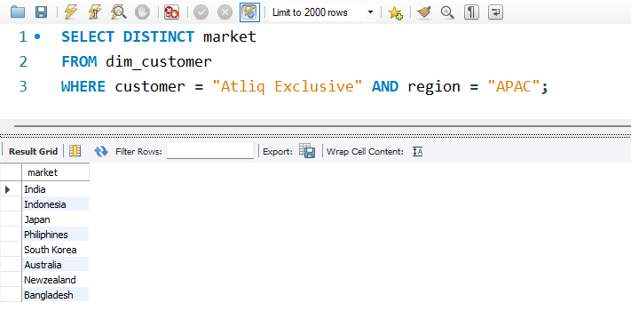
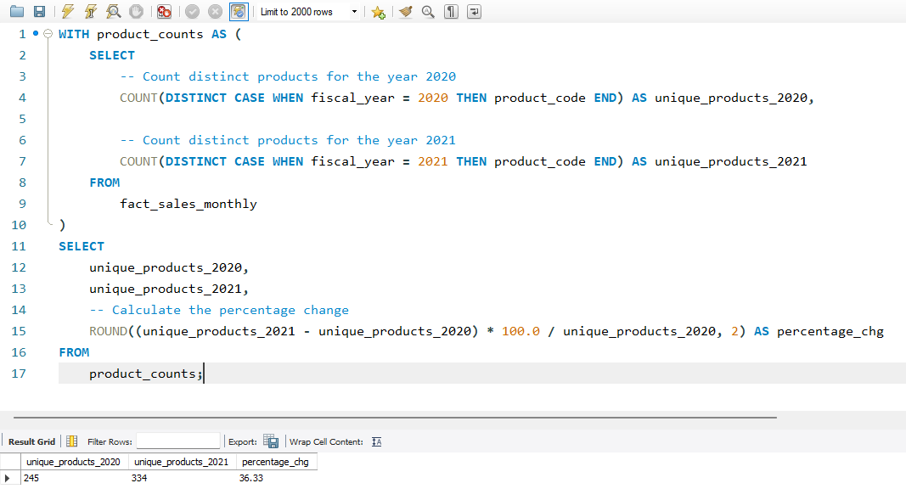
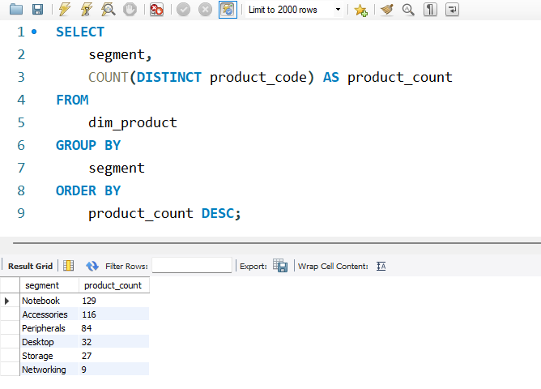
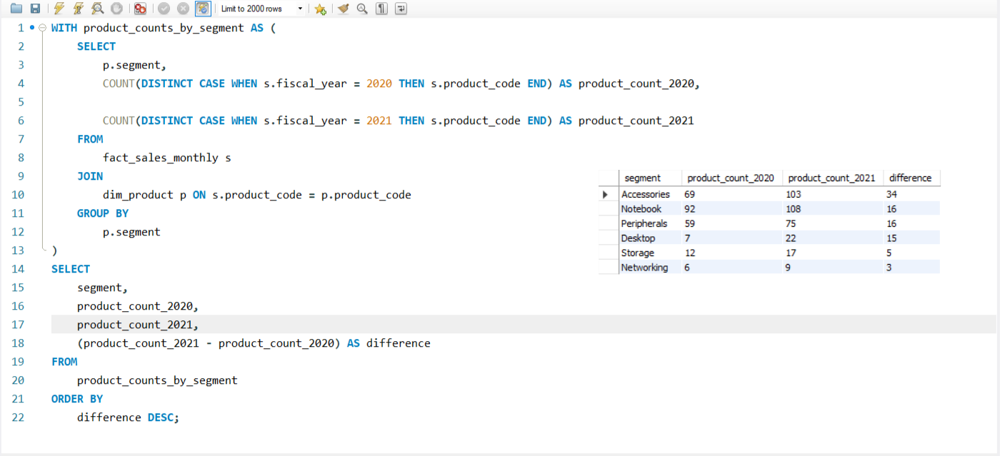
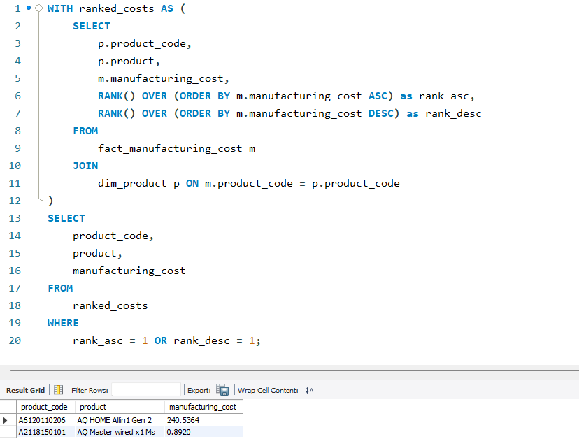
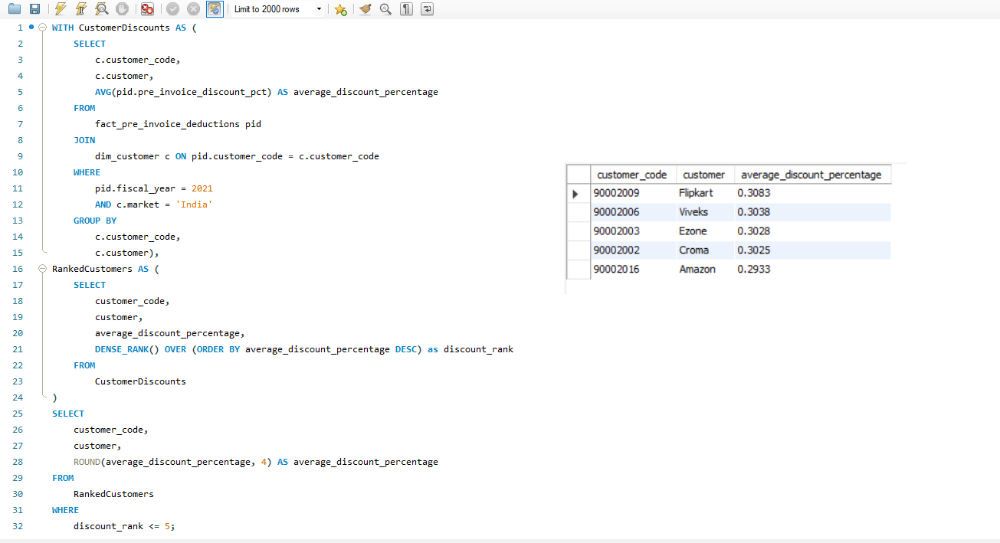
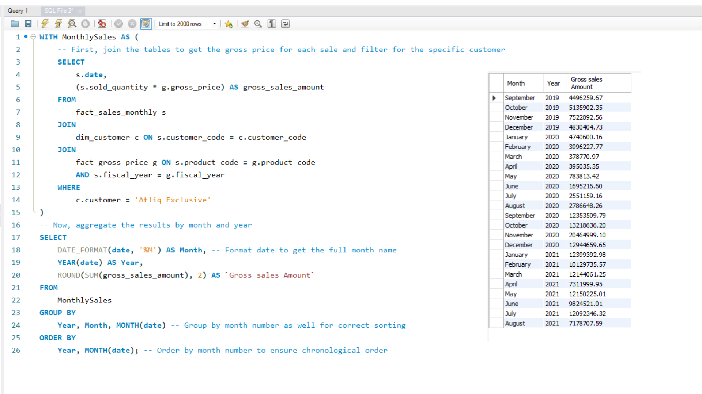
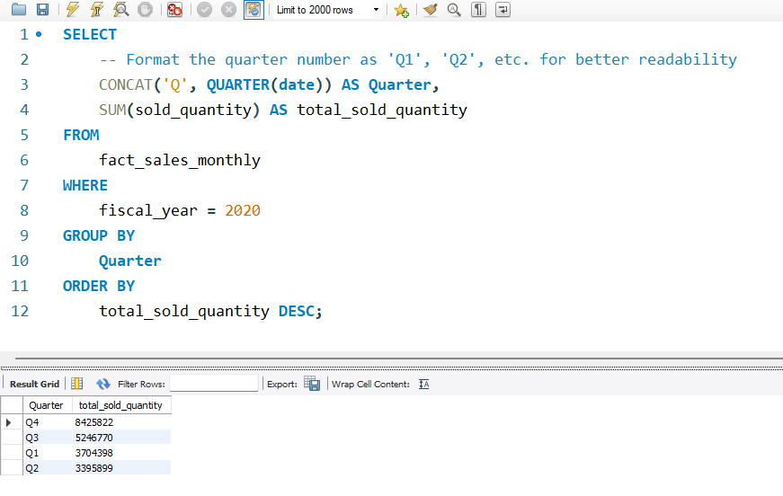
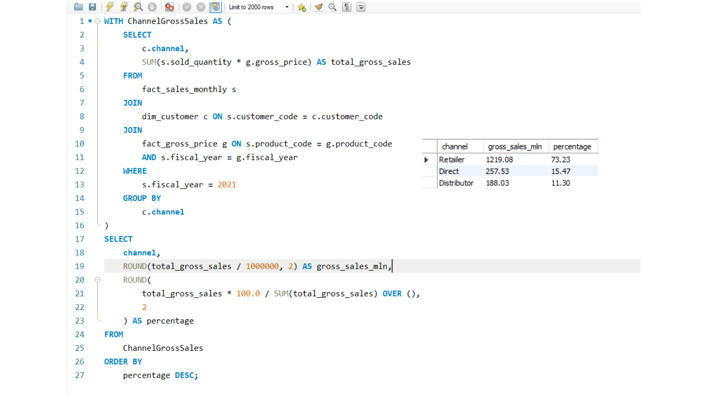
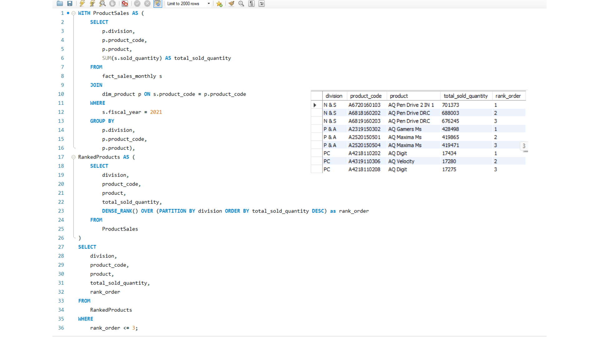

  <h1>Ad-Hoc SQL Analysis for AtliQ Hardware 📈</h1>

*A comprehensive SQL-based case study solving real-world business problems for a global consumer goods company, demonstrating a deep understanding of the analytical process from stakeholder questions to actionable insights.*

---

## 📖 Table of Contents

- [Project Context & Business Problem](#-project-context--business-problem)
- [The Analyst's Process](#-the-analysts-process)
- [The 10 Business Requests, Solutions & Results](#-the-10-business-requests-solutions--results)
- [Skills Showcase](#-skills-showcase)
- [Repository Structure](#-repository-structure)
- [Contact](#-contact)

---

## 🎯 Project Context & Business Problem

**AtliQ Hardware** is a rapidly growing computer hardware company with a global presence. Historically, their decisions were based on intuition and basic analysis. To stay competitive and foster a data-driven culture, the management team commissioned a series of ad-hoc data analysis requests.

This project simulates that real-world scenario. The primary objective is to act as a data analyst for AtliQ Hardware, answering ten pressing business questions by writing and executing complex SQL queries against the company's database.

---

## 💡 The Analyst's Process

A successful data analysis project starts long before the first line of SQL is written. It begins with a deep understanding of the stakeholder's needs. Before tackling this project, a good analyst would clarify the following:

* **Project Objective:** What is the primary business goal of this analysis?
* **Success Metrics:** How will the success of these requests be measured?
* **Stakeholder Expectations:** Who will be using these insights and for what purpose?
* **Data Requirements:** What are all the data sources needed to answer these questions?
* **Potential Roadblocks:** What could go wrong, and what are the data quality concerns?

This mindset of asking "why" before "how" is crucial for delivering valuable insights, and it was the guiding principle for this project.

---

## 📋 The 10 Business Requests, Solutions & Results

The following ten business questions were presented by the stakeholders. Each request is followed by a link to its standalone SQL query and a collapsible section containing a screenshot of the final result.

1.  **Market Analysis:** Provide the list of markets in which customer "Atliq Exclusive" operates its business in the APAC region. **[View Solution](solutions/1_market_analysis_apac.sql)**
    

    
Click to View Result

    
    

2.  **Product Performance:** What is the percentage of unique product increase in 2021 vs. 2020? **[View Solution](solutions/2_unique_product_increase.sql)**
    

    
Click to View Result

    
    

3.  **Product Segmentation:** Provide a report with all the unique product counts for each segment, sorted in descending order. **[View Solution](solutions/3_product_count_by_segment.sql)**
    

    
Click to View Result

    
    

4.  **Segment Growth Analysis:** Which segment had the most increase in unique products from 2020 to 2021? **[View Solution](solutions/4_segment_growth_analysis.sql)**
    

    
Click to View Result

    
    

5.  **Manufacturing Cost Analysis:** Get the products that have the highest and lowest manufacturing costs. **[View Solution](solutions/5_manufacturing_cost_extremes.sql)**
    

    
Click to View Result

    
    

6.  **Customer Discount Analysis:** Generate a report of the top 5 customers who received the highest average pre-invoice discount percentage in fiscal year 2021 in the Indian market. **[View Solution](solutions/6_top_5_customer_discounts.sql)**
    

    
Click to View Result

    
    

7.  **Sales Trend Analysis:** Get the complete report of the Gross Sales Amount for the customer “Atliq Exclusive” for each month. **[View Solution](solutions/7_monthly_gross_sales_report.sql)**
    

    
Click to View Result

    
    

8.  **Quarterly Sales Analysis:** In which quarter of 2020 did AtliQ Hardware get the maximum total sold quantity? **[View Solution](solutions/8_max_quantity_quarter_2020.sql)**
    

    
Click to View Result

    
    

9.  **Channel Performance:** Which channel helped to bring more gross sales in the fiscal year 2021 and what was its percentage contribution? **[View Solution](solutions/9_channel_contribution_2021.sql)**
    

    
Click to View Result

    
    

10. **Division Performance:** Get the Top 3 products in each division that have a high total sold quantity in the fiscal year 2021. **[View Solution](solutions/10_top_3_products_by_division.sql)**
    

    
Click to View Result

    
    

---

## 🛠️ Skills Showcase

This project demonstrates proficiency in a wide range of SQL skills and analytical thinking.

| Category | Skills & Techniques |
|---|---|
| **Advanced SQL** | Window Functions (`RANK()`, `DENSE_RANK()`, `SUM() OVER()`), Common Table Expressions (CTEs), Subqueries. |
| **Data Aggregation**| `GROUP BY`, `SUM()`, `COUNT(DISTINCT)`, `AVG()`, `MAX()`. |
| **Data Analysis** | Time-Series Analysis (Month/Quarter), Contribution Analysis, Top-N Analysis per Category, Comparative Analysis (Year-over-Year). |
| **Data Manipulation** | Complex `JOIN`s, Date Functions (`YEAR`, `QUARTER`, `DATE_FORMAT`), Conditional Logic (`CASE` statements). |

---

## 📂 Repository Structure

* **`solutions/`:** Contains each of the 10 SQL queries in its own separate, clearly named file.
* **`results/`:** Contains a screenshot of the output for each of the 10 requests.
* **`all_solutions.sql`:** A single, consolidated file containing all 10 commented queries for a quick review.
* **`README.md`:** This file.

---

## 📫 Contact

I am a passionate data analyst dedicated to turning complex data into clear, actionable insights. If you have any questions about this project or would like to connect, please feel free to reach out.

* **Email:** <nayanreddy007@gmail.com>
